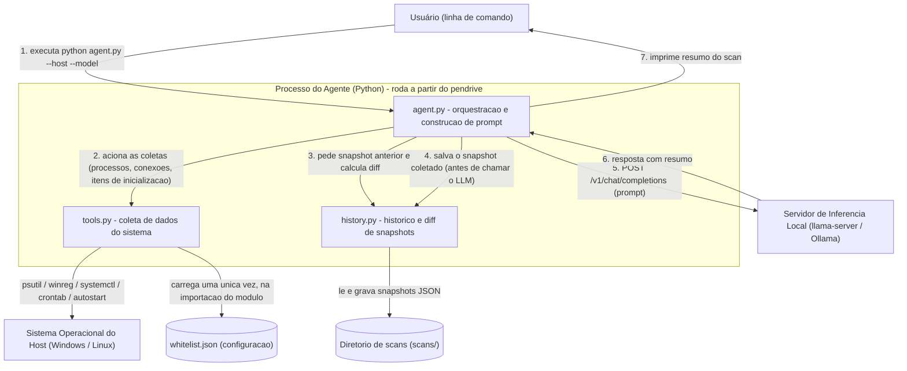
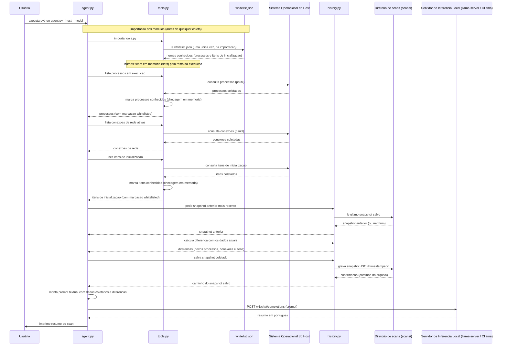
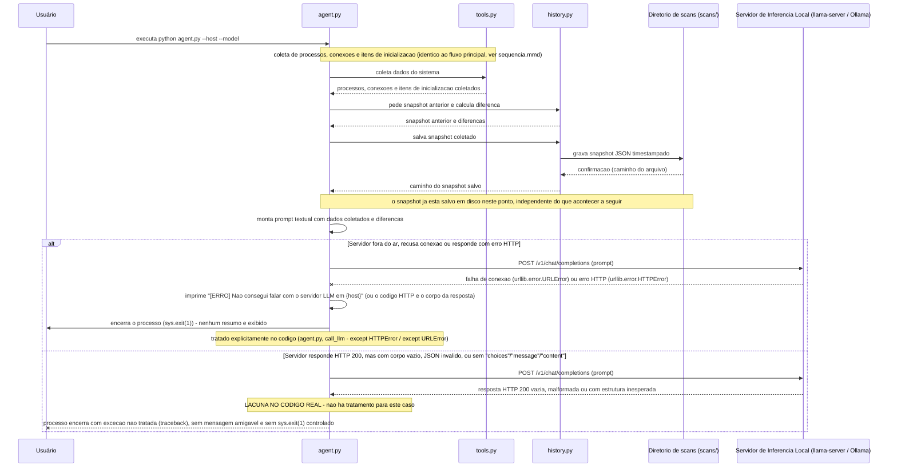

# PendriveAgent — Documentação

PendriveAgent é um agente de triagem de segurança que roda inteiramente a
partir de um pendrive: coleta processos em execução, conexões de rede
ativas e itens de inicialização automática do computador em que é ligado,
compara com o scan anterior e usa um modelo de linguagem local (via
llama.cpp/llama-server ou Ollama) só para interpretar esses dados e
escrever um resumo em português. Não há nuvem, não há telemetria, não há
instalação — tudo roda localmente, inclusive o interpretador Python e o
motor de inferência, se o pendrive vier com eles. O próprio sistema se
declara uma camada de leitura e triagem, não um antivírus.

Este repositório documenta a arquitetura desse sistema como exercício de
"diagrams as code" de uma pós-graduação. Ele não contém o código-fonte do
PendriveAgent — só a descrição, os diagramas derivados dela, e o histórico
de como esses diagramas foram corrigidos depois de confrontados com o
código real.

## A descrição completa

A descrição arquitetural está em [`docs/descricao.md`](docs/descricao.md),
escrita no nível 2 do C4 (containers). Em resumo: o sistema roda como um
único processo Python, que reúne `agent.py`, `tools.py` e `history.py`, e
esse processo conversa com três coisas de fora dele — o sistema
operacional do host (via `psutil`, `winreg`, `systemctl` e `crontab`,
dependendo da plataforma), um arquivo de configuração de whitelist editado
à mão, e um servidor de inferência local compatível com a API de chat
completions da OpenAI. O documento também registra as restrições do
sistema — execução 100% local, a partir do pendrive, com modelos pequenos
e quantizados — e fecha com uma seção de lacunas honesta sobre o que o
código não decide: não há testes automatizados, não há rotação dos
snapshots antigos em `scans/`, Windows e Linux têm cobertura desigual de
itens de inicialização, e o tratamento de erro da chamada ao modelo de
linguagem é só parcial.

## Diagramas

Os diagramas abaixo são a versão final, corrigida depois de ler o código
real. As versões iniciais, produzidas só a partir da descrição em prosa,
continuam na pasta `docs/diagramas/` com o sufixo `-v1`, para permitir a
comparação antes/depois.

### Visão de containers

Fonte: [`docs/diagramas/estrutural.mmd`](docs/diagramas/estrutural.mmd) —
versão inicial: [`estrutural-v1.mmd`](docs/diagramas/estrutural-v1.mmd)

### Fluxo principal — execução de um scan completo

Fonte: [`docs/diagramas/sequencia.mmd`](docs/diagramas/sequencia.mmd) —
versão inicial: [`sequencia-v1.mmd`](docs/diagramas/sequencia-v1.mmd)

### Cenário de falha — servidor de inferência fora do ar ou resposta inválida

Fonte: [`docs/diagramas/sequencia-falha.mmd`](docs/diagramas/sequencia-falha.mmd)
— sem equivalente na v1, já que a primeira rodada de diagramas cobriu só o
fluxo principal.

## Decisões e ajustes sobre o que o modelo gerou

O primeiro diagrama estrutural e o primeiro diagrama de sequência
(`estrutural-v1.mmd` e `sequencia-v1.mmd`, mantidos na pasta) foram
desenhados só a partir da descrição em prosa, sem consultar o
código-fonte — uma simulação de arquiteto sem acesso ao sistema real.
Depois de ler o código e comparar em
[`docs/comparacao-v1.md`](docs/comparacao-v1.md), apareceram dois erros
concretos, os dois de ordem e de tempo, não de containers inventados. O
diagrama de sequência da v1 colocava o salvamento do snapshot como último
passo da jornada; no código, ele acontece antes de qualquer tentativa de
falar com o modelo de linguagem, exatamente para que o histórico sobreviva
mesmo que a chamada ao LLM falhe. O mesmo diagrama também tratava a
consulta à whitelist como uma troca de mensagens repetida durante a
coleta, quando na realidade o arquivo é lido uma única vez, na importação
do módulo, e fica em memória dali em diante.

Os diagramas finais corrigem os dois pontos, e um terceiro diagrama, sem
equivalente na v1, cobre o que acontece quando o servidor de inferência
está fora do ar ou devolve uma resposta que o código não sabe interpretar
— nesse segundo caso, o próprio sistema não trata o erro, e o diagrama
registra isso como lacuna, não como comportamento correto. O relato
completo, ajuste por ajuste, está em
[`docs/decisoes-e-ajustes.md`](docs/decisoes-e-ajustes.md).

## O que um agente precisaria para construir sem inventar decisões

Mesmo com a descrição e os diagramas corrigidos, ficam decisões que o
código não toma — e que qualquer agente, humano ou automatizado, tentando
reconstruir ou estender o PendriveAgent teria que inventar, porque nada no
sistema diz o que fazer.

O formato do relatório de saída é um exemplo direto: hoje o resumo do LLM
só é impresso no terminal, em texto solto, e não é salvo em lugar nenhum —
nem junto do snapshot, nem em um arquivo separado. Um agente que
precisasse de relatórios navegáveis, comparáveis entre execuções ou
exportáveis teria que decidir sozinho onde e em que formato esse texto
passaria a viver, porque o sistema atual simplesmente descarta o resumo
assim que o processo termina.

O critério de entrada na whitelist também não existe além de "editar o
JSON à mão". Não há processo de proposta, aprovação ou expiração de itens,
nem distinção entre o que foi adicionado por ser claramente seguro (um
executável do próprio Windows) e o que foi adicionado só para silenciar um
alerta incômodo. Uma automação que tentasse sugerir novos itens de
whitelist a partir dos scans teria que definir esse critério do zero.

O mesmo vale para o limiar do diff entre scans: hoje "mudou" significa só
"apareceu um nome que não estava no snapshot anterior" — uma comparação
binária de presença e ausência, sem noção de tempo, frequência ou
severidade. Um processo que aparece, some e reaparece a cada scan por um
motivo legítimo geraria o mesmo alerta que um processo genuinamente novo e
suspeito; decidir se isso importa, e como agrupar ou suprimir ruído desse
tipo, fica inteiramente em aberto.

A versão e os parâmetros do modelo de linguagem e do llama.cpp também não
estão fixados em lugar nenhum que o código controle. O `README.md`
original do sistema recomenda um modelo (Llama 3 8B, quantizado em
Q4_K_M) e um tamanho de contexto como sugestão de configuração ao subir o
`llama-server` manualmente, mas nada disso é imposto ou validado por
`agent.py` — ele aceita qualquer `--model` e qualquer `--host`, sem checar
se o servidor do outro lado é compatível ou está configurado como
esperado.

O tratamento de erros da chamada ao LLM está descrito com precisão em
`docs/descricao.md` e no diagrama de falha acima: conexão recusada e erro
HTTP são tratados com uma mensagem e um `sys.exit(1)` controlado, mas
resposta vazia, JSON inválido ou uma estrutura de resposta inesperada não
têm nenhum tratamento — o processo simplesmente quebra com um traceback.
Qualquer extensão do sistema teria que decidir se isso é aceitável para o
caso de uso atual (um script rodado manualmente) ou se precisa de
tratamento explícito antes de, por exemplo, rodar como tarefa agendada.

Por fim, as diferenças entre Windows e Linux na coleta de itens de
inicialização não vêm de uma decisão documentada — são simplesmente o que
foi implementado. No Windows, só as chaves de registro `Run` de usuário e
de máquina são lidas, sem checagem do Agendador de Tarefas nem de
serviços registrados. No Linux a cobertura é mais ampla (systemd, crontab,
autostart de aplicações), mas não existe suporte a macOS em nenhuma parte
do código. Um agente que precisasse de paridade entre plataformas teria
que decidir se estende a cobertura do Windows para igualar a do Linux, ou
se aceita a assimetria como está.

## Observação sobre dados sensíveis

Este repositório é público. Ele descreve o **formato** de arquivos como
`whitelist.json`, mas não reproduz nenhum conteúdo desse arquivo nem
qualquer dado coletado de uma máquina real (nomes de processos específicos
de um ambiente, caminhos pessoais, endereços IP, etc.).
