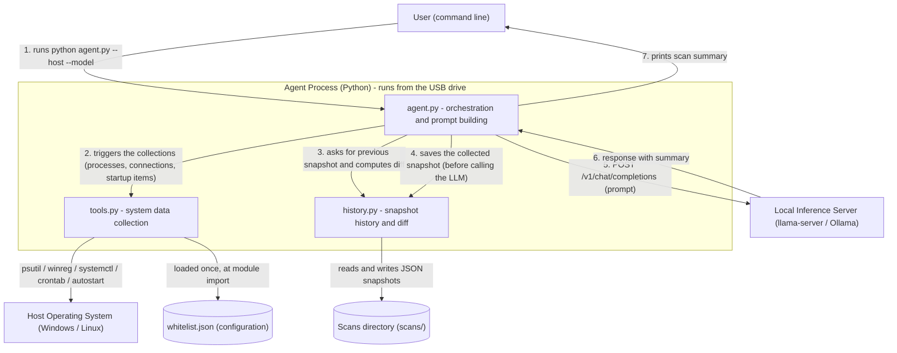
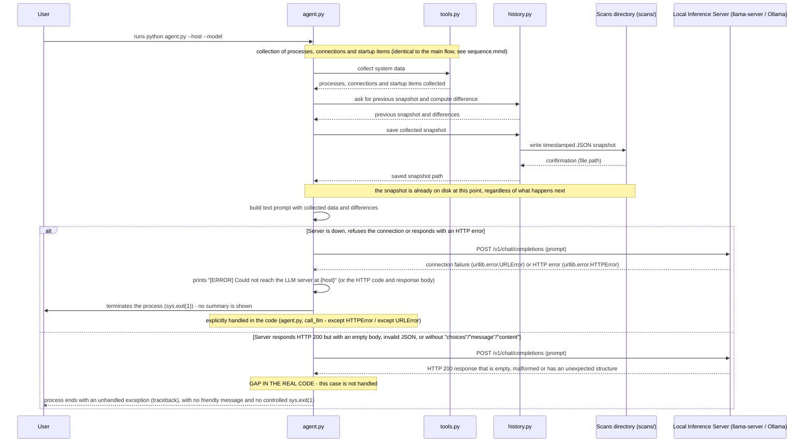

# PendriveAgent - Documentation

[](LICENSE)

PendriveAgent is a security triage agent that runs entirely from a USB drive: it
collects running processes, active network connections and automatic startup
items from the computer it is plugged into, compares them with the previous
scan, and uses a local language model (via llama.cpp/llama-server or Ollama)
only to interpret that data and write a summary. There is no cloud, no
telemetry, no installation - everything runs locally, including the Python
interpreter and the inference engine, if the USB drive ships with them. The
system itself declares that it is a reading and triage layer, not an antivirus.

This repository documents the architecture of that system as a "diagrams as
code" exercise from a postgraduate course. It does not contain the PendriveAgent
source code (see
[Pendrive_agent_HealthCheck](https://github.com/guirodrigues0987/Pendrive_agent_HealthCheck)
for that) - only the description, the diagrams derived from it, and the history
of how those diagrams were corrected after being checked against the real code.

## Repository layout

```
docs/
├── description.md                 # C4 level 2 architecture description
├── decisions-and-adjustments.md   # Architecture decisions and diagram corrections
├── v1-comparison.md               # v1 diagrams vs. the real code
└── diagrams/                      # Mermaid sources (final and v1)
```

## The full description

The architecture description is in [`docs/description.md`](docs/description.md),
written at C4 level 2 (containers). In short: the system runs as a single Python
process, which brings together `agent.py`, `tools.py` and `history.py`, and that
process talks to three things outside it - the host operating system (via
`psutil`, `winreg`, `systemctl` and `crontab`, depending on the platform), a
hand-edited whitelist configuration file, and a local inference server
compatible with the OpenAI chat completions API. The document also records the
system's constraints - 100% local execution, from the USB drive, with small
quantized models - and closes with an honest gaps section about what the code
does not decide: there are no automated tests, there is no rotation of old
snapshots in `scans/`, Windows and Linux have uneven coverage of startup items,
and error handling of the language model call is only partial.

## Diagrams

The diagrams below are the final version, corrected after reading the real code.
The initial versions, produced only from the prose description, remain in the
`docs/diagrams/` folder with the `-v1` suffix, to allow the before/after
comparison.

### Container view



Source: [`docs/diagrams/structural.mmd`](docs/diagrams/structural.mmd) -
initial version: [`structural-v1.mmd`](docs/diagrams/structural-v1.mmd)

### Main flow - running a full scan


Source: [`docs/diagrams/sequence.mmd`](docs/diagrams/sequence.mmd) -
initial version: [`sequence-v1.mmd`](docs/diagrams/sequence-v1.mmd)

### Failure scenario - inference server down or invalid response



Source: [`docs/diagrams/sequence-failure.mmd`](docs/diagrams/sequence-failure.mmd)
- no equivalent in v1, since the first round of diagrams covered only the main
flow.

## Decisions and adjustments to what the model generated

The first structural diagram and the first sequence diagram
(`structural-v1.mmd` and `sequence-v1.mmd`, kept in the folder) were drawn only
from the prose description, without consulting the source code - a simulation of
an architect without access to the real system. After reading the code and
comparing in [`docs/v1-comparison.md`](docs/v1-comparison.md), two concrete
errors appeared, both about order and timing, not about invented containers. The
v1 sequence diagram placed the snapshot save as the last step of the journey; in
the code, it happens before any attempt to talk to the language model, precisely
so the history survives even if the LLM call fails. The same diagram also
treated the whitelist lookup as a message exchange repeated during collection,
when in reality the file is read only once, at module import, and stays in
memory from then on.

The final diagrams fix both points, and a third diagram, with no equivalent in
v1, covers what happens when the inference server is down or returns a response
the code does not know how to interpret - in this second case, the system itself
does not handle the error, and the diagram records that as a gap, not as correct
behavior. The full account, adjustment by adjustment, is in
[`docs/decisions-and-adjustments.md`](docs/decisions-and-adjustments.md).

## What an agent would need to build without inventing decisions

Even with the description and the corrected diagrams, decisions remain that the
code does not make - and that any agent, human or automated, trying to rebuild
or extend PendriveAgent would have to invent, because nothing in the system says
what to do.

The output report format is a direct example: today the LLM summary is only
printed to the terminal, as loose text, and is not saved anywhere - neither next
to the snapshot nor in a separate file. An agent that needed navigable,
comparable or exportable reports would have to decide on its own where and in
what format this text would live, because the current system simply discards the
summary as soon as the process ends.

The criterion for entering the whitelist also does not exist beyond "edit the
JSON by hand". There is no process for proposing, approving or expiring items,
nor a distinction between what was added because it is clearly safe (a Windows
executable) and what was added just to silence an annoying alert. An automation
trying to suggest new whitelist items from the scans would have to define that
criterion from scratch.

The same goes for the diff threshold between scans: today "changed" means only
"a name appeared that was not in the previous snapshot" - a binary
presence/absence comparison, with no notion of time, frequency or severity. A
process that appears, disappears and reappears on every scan for a legitimate
reason would generate the same alert as a genuinely new and suspicious process;
deciding whether that matters, and how to group or suppress that kind of noise,
is left entirely open.

The version and parameters of the language model and of llama.cpp are also not
pinned anywhere the code controls. The system's original `README.md` recommends
a model (Llama 3 8B, quantized as Q4_K_M) and a context size as a configuration
suggestion when manually starting `llama-server`, but none of that is enforced
or validated by `agent.py` - it accepts any `--model` and any `--host`, without
checking whether the server on the other side is compatible or configured as
expected.

Error handling of the LLM call is described precisely in `docs/description.md`
and in the failure diagram above: connection refused and HTTP errors are handled
with a message and a controlled `sys.exit(1)`, but an empty response, invalid
JSON or an unexpected response structure has no handling - the process simply
breaks with a traceback. Any extension of the system would have to decide whether
that is acceptable for the current use case (a manually run script) or whether it
needs explicit handling before, for example, running as a scheduled task.

Finally, the differences between Windows and Linux in startup item collection do
not come from a documented decision - they are simply what was implemented. On
Windows, only the user and machine `Run` registry keys are read, with no check of
Task Scheduler or registered services. On Linux coverage is broader (systemd,
crontab, application autostart), but there is no macOS support anywhere in the
code. An agent that needed parity between platforms would have to decide whether
to extend Windows coverage to match Linux's, or to accept the asymmetry as it is.

## Note on sensitive data

This repository is public. It describes the **format** of files such as
`whitelist.json`, but reproduces no content of that file nor any data collected
from a real machine (environment-specific process names, personal paths, IP
addresses, etc.).

## License

[MIT](LICENSE)
